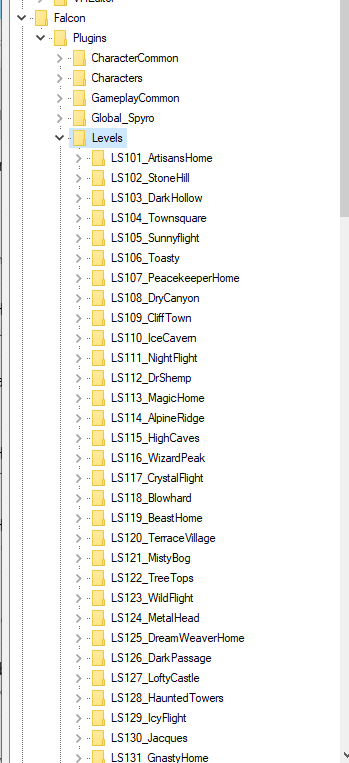

## Introduction

Currently there are two ways you can make custom levels, replacing current level from reignited and making entirely new levels. 

## Example Project For Creating Your Level:

[Start by downloading starter project made for Spyro Reignited Trilogy](https://github.com/InfinateXtremer/ReignitedTrilogyWorkspace) This project includes custom made blueprints for spawning in-game mechanics and examples on how to use them for a mod.

!!! warning
	Because of file path limit in Unreal Engine it is highly recommended to place project in root of your drives like: `D:/UE4`

## Creating Your Level

Before populating your level, you need to create it first. There are two methods you can use to load maps in Spyro Reignited Trilogy. 

1. **Content folder method**
    - Doesn't replace any default maps, but guaranteed save corruption.
    - Removes the need to making plugins folder when paking your mod.
    - **If you don't care about save corruption, this is the best way to make a level mod**
2. **Plugins Method**
    - Doesn't corrupt saves, if done correctly..
    - More clutter when paking because of plugins folder.
3. **Mixing  Method**

# Content Folder Method

Simply use the Content folder in the Unreal Editor.

## Plugin Name Method 
Plugin names for the levels can be found at **Falcon/Plugins/Levels** and you can use them by [replicating the game structure](../Preparing-Modding/Replicating-the-Game-Structure-Unreal.md) 

Making levels in Spyro Reignited Trilogy is no different than making a level for an Unreal Engine 4. If you know how to make levels in Unreal Engine, skip to **3rd page**

# Loading Levels

[Use console injector to load the custom map you created](https://docs.google.com/document/d/1ls08FMu6mK_CpvhX-Lf6NbujuPubnI0dJPX8oIv1u3k/edit?usp=sharing)