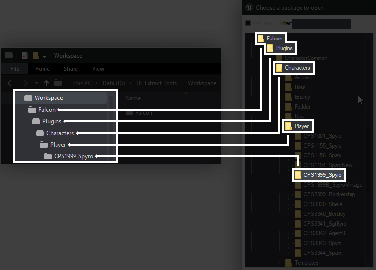

After **replicating file sturcture in Unreal Editor** and **Cooking content for Windows** *or* **Using Wwise create your .wem and .bnk files** *it is time to turn them into a pak file.*

## Using U4PAK

------

!!! info
  	All three of the u4pak linked below ***do the same process*** however **user friendly u4pak can't extract pak files** and **is only aimed at creating paks, making whole process easier for mod creation.**

### U4PAK Download Links:

* [User friendly u4pak with folders already created](https://cdn.discordapp.com/attachments/620305369276612668/816465582705868800/U4PAK.7z)
* [Exe version of u4pak `.bat`/`.cmd` releases](https://github.com/FranklyGD/Spyro-Reignited-Trilogy-Asset-Replacement/releases/tag/fp1.0) 
* [Python version of u4pak `.cmd` releases](https://github.com/panzi/u4pak) 

## Installing:

Extract u4pak to anywhere you like, **extracted folder will be called *`Workspace`* from now on.**

# Folder Replication

------

Now that you know how to use u4pak, **you need to replicate file structure of Reignited** to replace in-game assets with the new ones you created.

In order for your mod to work properly you need to replicate the exact file structure from UModel in your U4Pak folder.

!!! reminder 
	**User Friendly version already have folders setup for main characters.**

## Identifying a plugin

------

Due to how Toys For Bob's internal structure works, *plugins folder will have subfolders that are not plugins themselves*. **Due to this you need to find the correct folder that hosts the real plugin.**

**Plugins are easily identified by the directory that contains a sub-folder named** `Content`. 

## Naming Your Assets

------

**You already should have correct asset named if you followed [Replicating the Game Structure Unreal page.](../Preparing-Modding/Replicating-the-Game-Structure-Unreal.md) ** 

**Just to be sure, make sure assets are named the same as the files found in umodel.**

------

## Replicating Folder Structure In u4pak

In your *workspace* folder(where u4pak is) create the same folder structure as you would see in umodel. After doing this you can place your files in their respective locations.

## Post-Paking
!!! warning
	Depending on the skeleton, you might need to reimport all the animations or delete skeleton and physics assets for the mesh you are going to replace. [Mesh Setup page should have a list for said models.](../Replacing-Files/Modelling/Mesh-Setup.md) 
	

## Usage

Every u4pak version have different ways to use them:

| Version                                                      | Usage                        |
| ------------------------------------------------------------ | ---------------------------- |
| [User Friendly Version](https://cdn.discordapp.com/attachments/620305369276612668/816465582705868800/U4PAK.7z) | Run u4pak.exe                |
| [Exe Version](https://github.com/FranklyGD/Spyro-Reignited-Trilogy-Asset-Replacement/releases/tag/fp1.0) | Run u4pak.cmd                |
| [Python Version](https://github.com/panzi/u4pak)             | u4pak.py pack -z pakname.pak |

After using their respective methods, you will end up with a .pak file that contains your files.