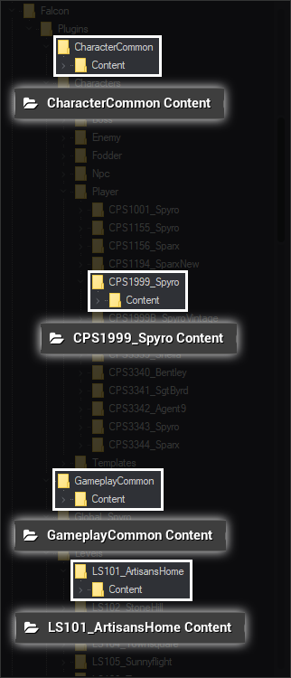
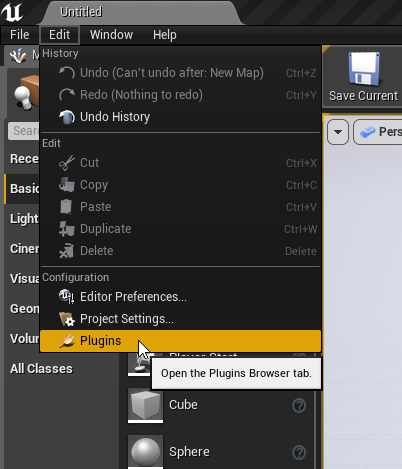
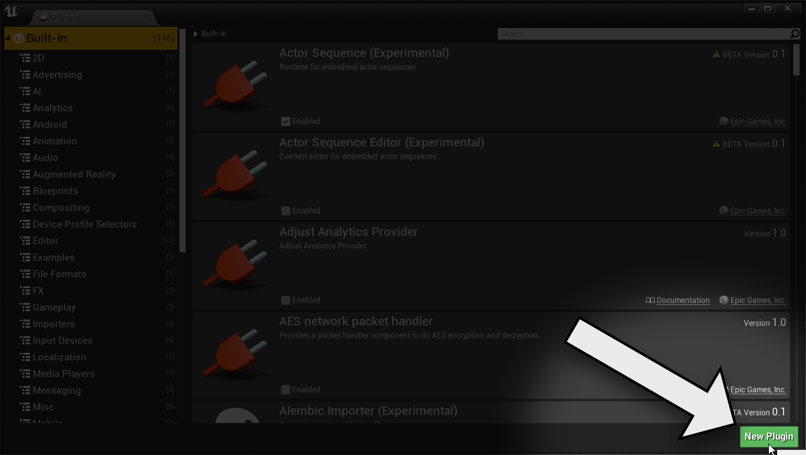
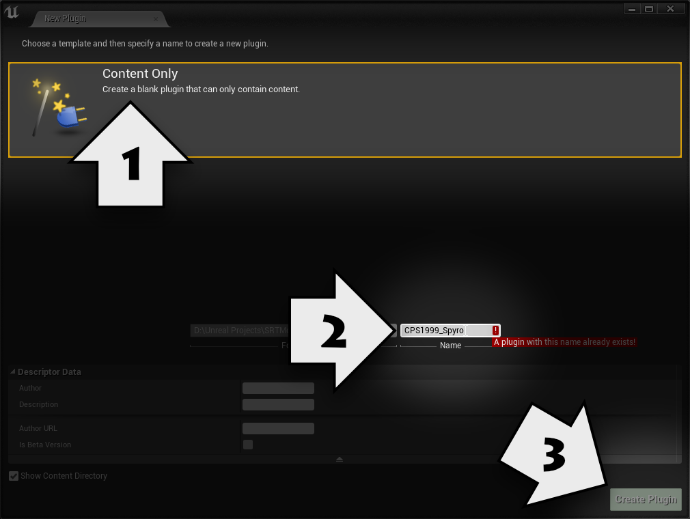
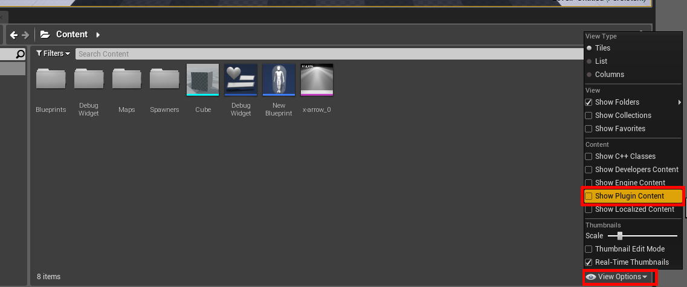
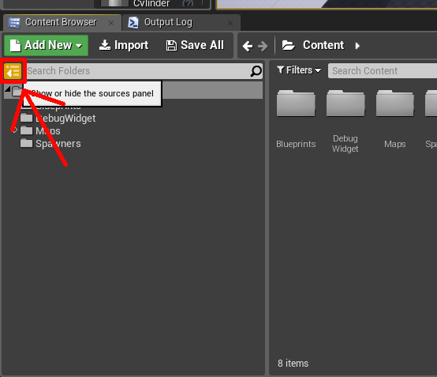
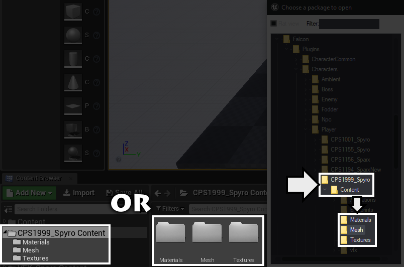
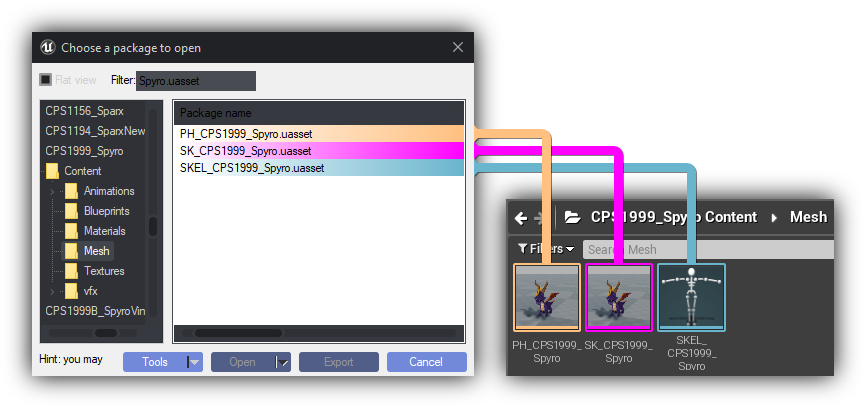

------

In order to replace a file, **it must mimic the file pattern of the original source game.** In order to do so, you must know how to use [**Umodel**](https://www.gildor.org/en/projects/umodel) to browse in-game files.

## Identifying a plugin

------

Due to how Toys For Bob's internal structure works, plugins folder will have subfolders that are not plugins themselves. **Due to this you need to find the correct folder that hosts the real plugin using *`umodel`*.**

[ :fontawesome-solid-arrow-right: How to install and use umodel](umodel.md){ .md-button }

**Plugins are easily identified by the directory that contains a sub-folder named** `Content`. 

## Creating the plugin in Unreal Engine

------

In the Unreal Editor, you will need to create a plugin. To do so, go to Edit > Plugins.  

Click on "New Plugin".  

Select "Content Only Plugin". **Name it exactly the same as how it was on Umodel**. 

!!! example
	If the plugin folder in Umodel is called **CPS1999_Spyro**, name it exactly **CPS1999_Spyro**. 

After naming your plugin, press "Create Plugin".  

## Making Your Plugin Visible In The Editor

------

Now with your plugin created you need to enable the option to see it in the **Content Browser** 

Open **View Options** and **Enable Show Plugin Content**

and enable **Sources Panel** to see grid view of plugins.

## Naming Your Assets

------

When you create a new plugin, Unreal Editor will automatically generate **Content** folder that **will not be visible in Unreal Editor**. **This mean you don't need to create a Content folder in Unreal Editor.**

Now go back to Umodel and check the name of the file **you want to replace** and **where it is located at**. **You need to replicate the exact file name and location in order to replace in-game assets.**

!!! example
	Let's say you're going to replace Spyro's mesh: **Your replacement meshes need to replicate folder and file structure of Reignited.** 

	In **Umodel** Spyro's mesh contains three assets. **PH_CPS1999_Spyro.uasset**, **SK_CPS1999_Spyro.uasset**, **SKEL_CPS1999_Spyro.uasset** located at **CPS1999_Spyro/Content/Mesh**
	
	Your own Spyro mesh needs to be at **`CPS1999_Spyro`** plugin, in the `Mesh` folder and names of all assets needs to be exact same as the ones in Umodel **without** **`.uasset`**.
	
	**So if you see in the viewer `SK_CPS1999_Spyro.uasset`, name in the Unreal Engine Editor should be `SK_CPS1999_Spyro`**

In order for skeletal replacement mods to work properly, you must have skeleton(cyan colored) and physics(orange colored) assets right besides skeletal mesh asset(purple colored) in Unreal Editor. 

**Again, make sure everything is named the same as the files found in Umodel Viewer** and **all of them are in the correct location and you have necessary files for skeletal meshes**

------

Now that you understand how to replicate file structure in Unreal you can continue with **Replacing Assets** tab or press one of the buttons below.

[Model Replacements](../Replacing-Files/Modelling/Mesh-Setup.md){ .md-button .md-button--primary }

[Texture Replacement](../Replacing-Files/Replacing-Textures.md){ .md-button .md-button--primary }

[Level Creation](../Level-Making/1-Introduction-To-Level-Making.md){ .md-button .md-button--primary }

[In-Game Text Replacement](../Replacing-Files/Replacing-Localization-Files.md){ .md-button .md-button--primary }

[Sound File Replacement](../Replacing-Files/Replacing-Sounds.md){ .md-button .md-button--primary }

