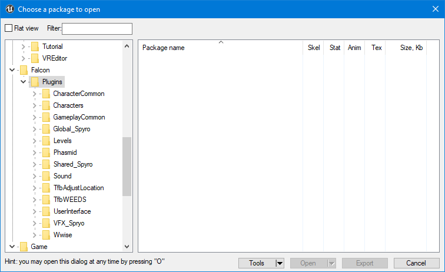
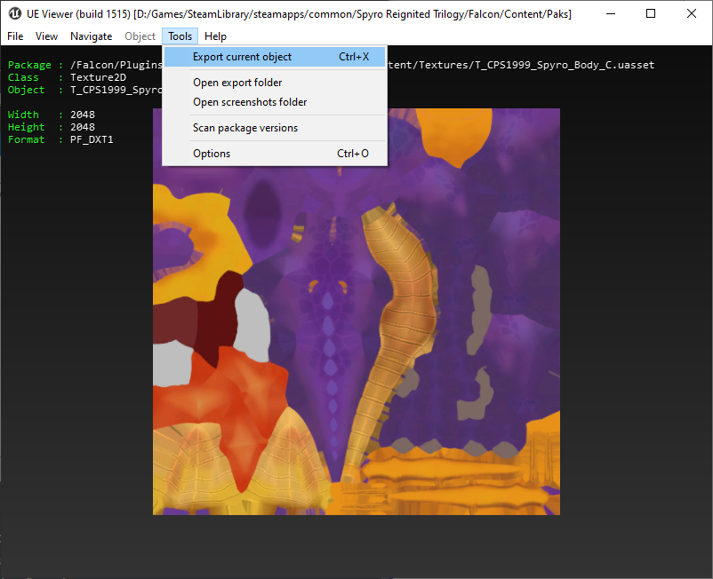
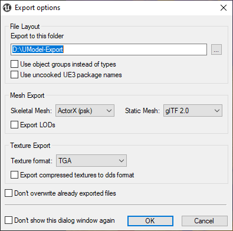

# How to use Umodel

------

## Download umodel

If you haven't already, start by downloading [Umodel Viewer/Explorer](https://www.gildor.org/en/projects/umodel) - [Github](https://github.com/gildor2/UModel) and extracting it to somewhere.

!!! Tip
	If you are having skeleton problems or incorrect bone weights, you can use an older version of [umodel](https://github.com/gildor2/UEViewer/tree/4f9664b6ac14a403ea80a47e5ea31e85f97bb223) or [Noesis Model Viewer](https://richwhitehouse.com/index.php?content=inc_projects.php)

!!! warning
	If you only want to replace **sounds,** you don't need **Unreal Engine 4** or **umodel**, instead refer to [Replacing Sounds](../Replacing-Files/Replacing-Sounds.md) page.

## Using umodel

For `Path to game files`  section, you need to use Spyro Reignited Trilogy's install location.

!!! tip 
	You can find where Spyro Reignited Trilogy is installed by going into Steam Library>Right click Spyro Reignited Trilogy> Properties.. > Local Files > Browse Local Files...

Next enable **Override game detection** and select **Unreal Engine 4** - **Unreal engine 4.19**.  
*You don't need to change any other setting.*

!!! tip 
	Most assets for Spyro Reignited Trilogy is located at **Falcon/Plugins**, You can find common file locations at [common file locations](../Resources/Common-File-Locations.md) page.

!!! reminder
	If you only want to replace **sounds,** Spyro Reignited Trilogy doesn't use default Unreal Engine 4 sounds system. Refer to [Replacing Sounds](../Replacing-Files/Replacing-Sounds.md) page.

**Take note of all the paths of files you want to modify so you can mimic it in your Unreal Mod project. **

## Exporting Your Assets

Once you find the asset you want to export, go to **Tools>Export Current Object**.

You **don't** need to change any option in here other than **Export to this folder**

**Next you need to install Unreal Engine 4.19.2 to create modded files.**
[ :fontawesome-solid-arrow-right: How To Install Unreal Engine 4.19.2](unreal.md){ .md-button .md-button--primary }