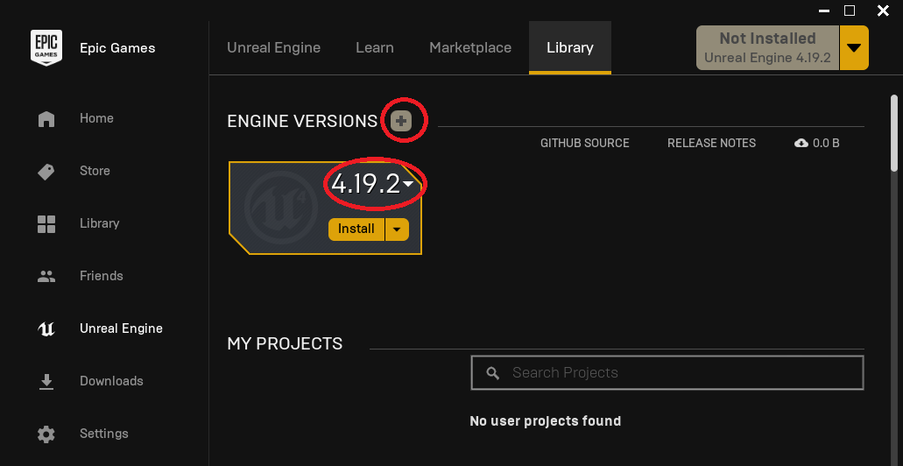
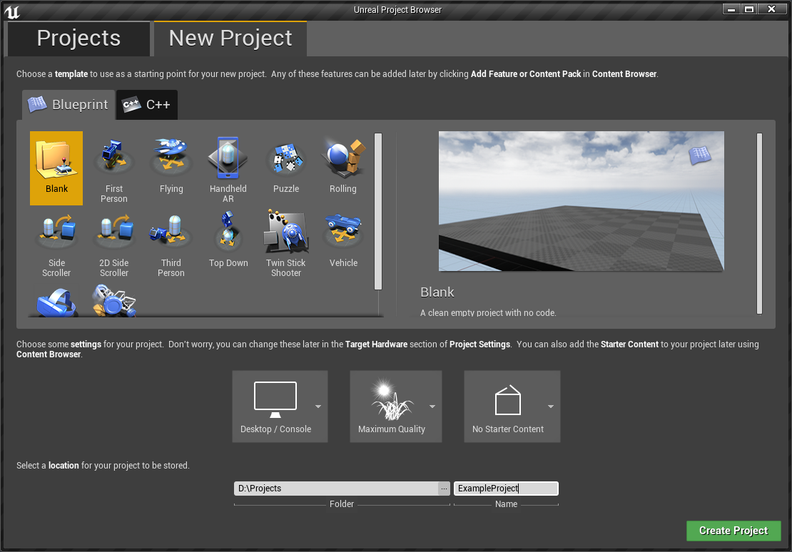

# How to Install And Create A Basic Project In Unreal Engine

------

## Unreal Engine Setup

You're need **Unreal Engine 4.19.2**

## Creating A New Project

------

If you're going to replace a **mesh** or a **texture**, open up Unreal Engine and **create a new project**, name it whatever you want, **note the name** as this will name be referred as **project name** from now on.

Your next step on modding is [:fontawesome-solid-arrow-right: Understanding and replicating the game structure](Replicating-the-Game-Structure-Unreal.md){ .md-button .md-button--primary }

If you haven't already, **Umodel is a must in order to understand where the files are located.**
[ :fontawesome-solid-arrow-right: Learn How To Use Umodel](umodel.md){ .md-button  }