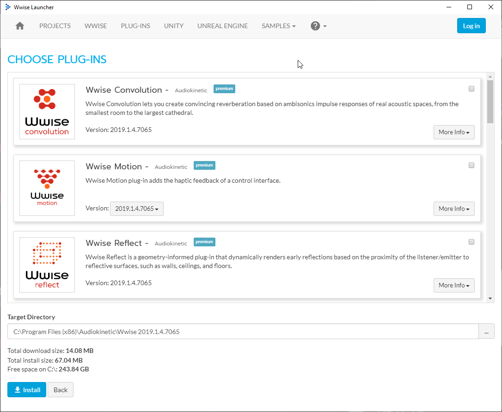

------

!!! note
	This page is incomplete, I don't know when I will write a fully summed up guide for this. In the meantime if you know how to do this free to write a guide so I can replace this page with yours.

# Requirements:

[Audiokinetic Wwise](https://www.audiokinetic.com/download/) (Needed for converting your sound files back to .wem)
Unreal Engine 4.19.2
umodel
Visual Studio 2017

## Wwise Install Settings

------

​	**You need to install Wwise 2017.2.6745**

**With the settings below:**

 **Disable all the plugins**

## **Integration with Unreal Engine**

------

Go to the `Unreal Engine` tab in Wwise. If you don't see any projects click on :material-format-list-bulleted-square: button, select `Browse for project...` and find your Unreal Engine project.

**IF YOU GET AN ERROR LIKE THIS**

Change Wwise version to **2017.10.6745.1113** and press `Integrate`.

Now you will see Wwise downloading required files.

After downloads finished you should see `Operation completed successfully.` prompt.

By default Wwise project will be in the Unreal Project's root folder with a _WwiseProject prefix.

## Finding Sound Events

------

Use umodel to find the **sound** you want to replace. 

To identify sounds, open any of the .uasset files inside sound folder and their class statistics should say **AkAudioEvent**.  Ignore any file that have anything else suchh as AkAudioBank.

**Note name of the sound you are going to replace without .uasset prefix**

From here on out we're going to refer these sounds as ***Sound Events***

Sounds are located at  **Plugins/Sound/Content**

## Importing Audio

------

By default Wwise should open with `Designer` layout. If not you can always change it by going to Layouts>Designer

Start by creating a new "Sound FX"

Right click on the newly created `Sound FX` and select `Import Audio Files...`, select your sounds on the opened pop-up.

After importing your sound, your Sound FX should turn from **red** to **blue**.

## Making Sliders Work With Your Replacements and Looping Your Sounds

------

On the  `Audio` tab and add three new "Audio Bus" below `Master Audio Bus`, call them `Effects`, `Music` and `Voice`

Next, select the Sound FX, this should switch right panel to the `Sound Property Editor`, change output bus to the corresponding audio bus. **E.g. If it's a music set it's audio bus to Music.**

To make your sound loop, enable `Loop` option.

## Creating Events And Adding Sounds To Events.

------

Remember the names you noted down? Now we are going to create them again in Wwise. Go to the Events tab in Wwise and create a Event. 

**Name of this event should match the exact same name from umodel without .uasset prefix.**

After creating your event, click on said event, this should switch to the ***Event Editor*** window (*highlighted in red*).

Next go back to the audio tab (*highlighted in blue*) and drag-drop your Sound FX into the Event Editor(higlighted in red) window.

Your Event Editor should look like this.

## Creating Soundbank

------

Due to how Wwise works, your sounds are need to be in soundbanks in order for them to work with Unreal Engine.

Go to Layouts>Soundbank

In the new windows, press New and then name your bank file.

After creating your SoundBank, select it. Your Sound Events should be on the left bottom panel (*highlighted in blue*), **drag and drop the Sound Event to the box highlighted in red.** This will add your Sound Event into the SoundBank.

## Creating AkAudioEvent and AkAudioBank In Unreal Editor

------

