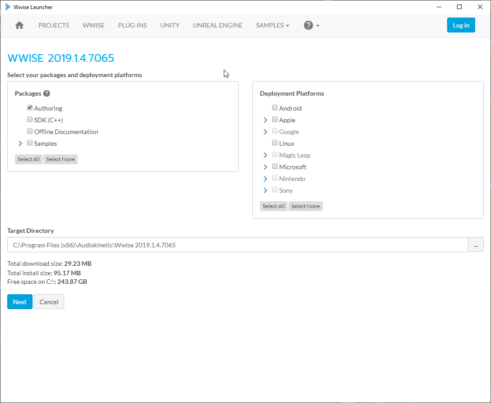
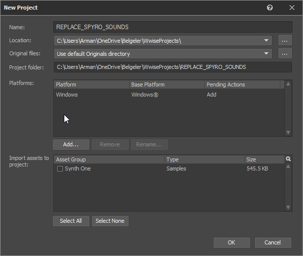
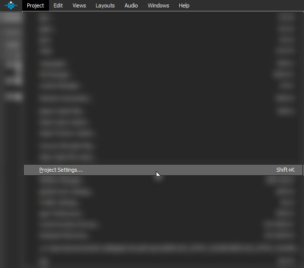
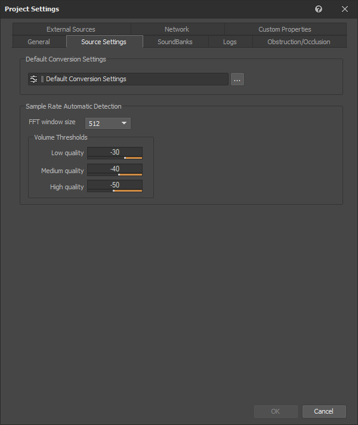
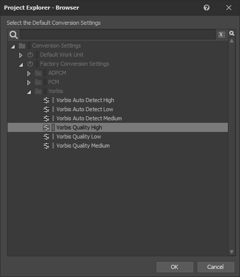
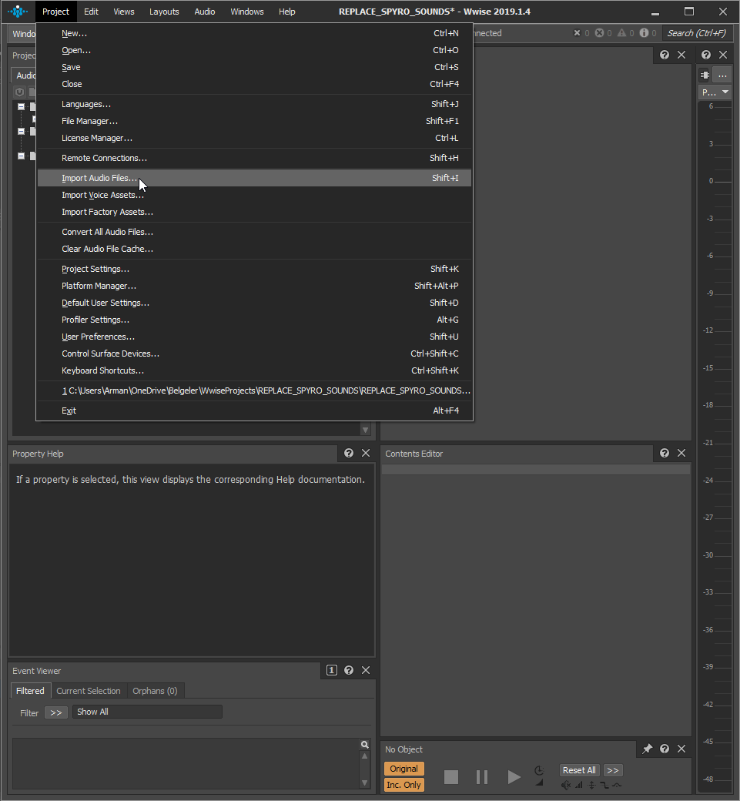
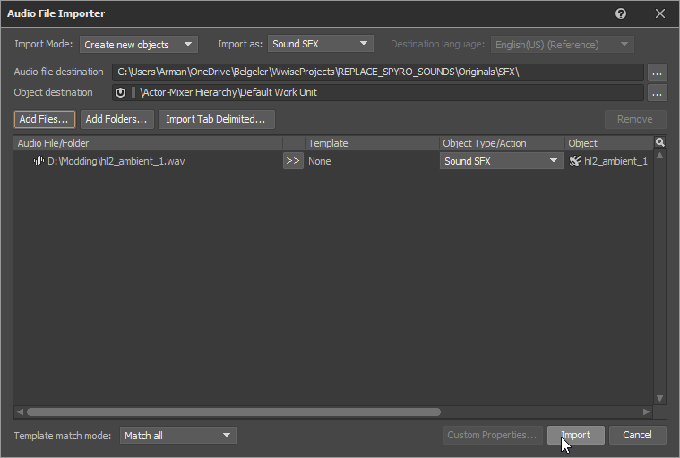
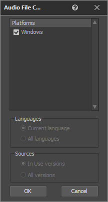

# Requirements:

* [Extracted Pak Files](../Pak-Files/Extracting-Pak-Files.md) 
* [Wwiseutils](https://github.com/hpxro7/wwiseutil/releases) **Download wwiseutil-gui.exe**
* A player that play .wem or .ogg sounds 

  * [Foobar2000](https://www.foobar2000.org/) with [vgmstream](https://github.com/losnoco/vgmstream/releases) is recommended. 

  * Download **foo_input_vgmstream.fb2k-component** from GitHub releases page
[and use this guide to install the component](https://wiki.hydrogenaud.io/index.php?title=Foobar2000:How_to_install_a_component)
* [Audiokinetic Wwise](https://www.audiokinetic.com/download/) (Needed for converting your sound files back to .wem)
* [.BNK extractor - bnkextr.exe](https://github.com/eXpl0it3r/bnkextr/releases) (optional **use WWiseutils GUI**)

## Listening to .wem files

Usng [Foobar2000](https://www.foobar2000.org/) with [vgmstream](https://github.com/losnoco/vgmstream/releases) plugin to listen to .wems is recommended.

You need to download **foo_input_vgmstream.fb2k-component** from [vgmstream's github page](https://github.com/losnoco/vgmstream/releases) [and use this guide to install the component](https://wiki.hydrogenaud.io/index.php?title=Foobar2000:How_to_install_a_component) after that you can open .wem sounds in Foobar2000 without converting them.

##  Extracting soundbanks (.bnk)
  * Use Wwiseutil GUI's extract function to extract them.

  * Alternatively Drag and drop the .bnk you want to extract to bnkextr.exe

## How to find specific sound file:

**Currently there is no a way to find a specific sound file you want** however .bnk files are named in a way that allows you generalize the sound you want. **SFX_Spyro_Bank.bnk** for example contains Spyro's sound effects.

extracting .bnk files doesn't yield file names so you have to listen and find the sound you want to replace. [You can check sound list for discovered sounds and add your own discoveries](https://docs.google.com/spreadsheets/d/1GpFxvt7E2eYGw-9fZ7xk63wQ89TdLnQDB2QbTzdaaZo/edit#gid=1427572063)

# Converting your sounds back to .wem format for import:
## Setting Up WWISE
 Install Wwise launcher and open it Install by going to WWISE tab and on install page only select *Authoring*

 Disable all the plugins

Make a new project and note the **Project Folder** location

Go to **Project** -> **Project Settings...**

Select the **Source Settings** tab and press the `...` button to open up audio quality options

Choose **Vorbis Quality High**

Press **OK** and close **Project Settings** window

!!! warning
	If your replaced audio does not play in game try changing **Vorbis Quality** to **Low** or **Medium**.

# Converting WAVS to WEM
To add your own sounds for .wem conversion go to: **Project** -> **Import Audio Files...**

Press **Add Files...** and choose the .wavs you want to convert, press **Import** to import them to your Wwise project

Go to Project -> **Convert All Audio Files**

Press OK

After pressing OK your sounds should be converted to .wem files. 

You can find your .wem files in your **Project Folder** *which by default located here*:
**Documents/WwiseProjects/PROJECT_NAME/.cache/Windows/SFX**

## Replacing the sounds
Open the .bnk file you want to change sounds using Wwiseutils.
Select the sound you want to replace and click replace button, select the .wem file you just converted. After you finished  replacing all the sounds, click Save to save it as .bnk file. 

##  [Next follow Replicating The Game Structure U4Pak page.](../Pak-Files/Replicating-the-Game-Structure-U4Pak.md) 

