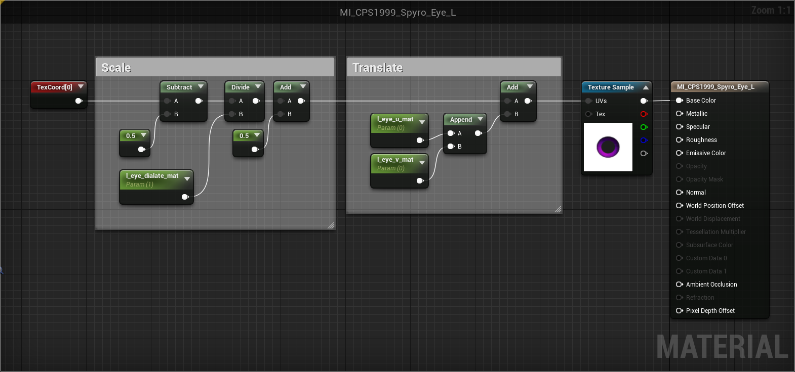
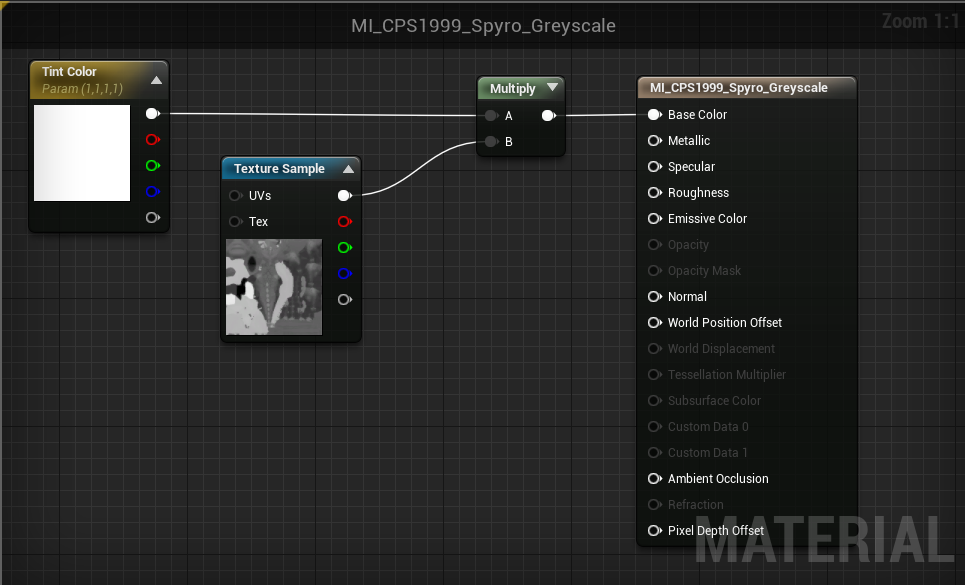
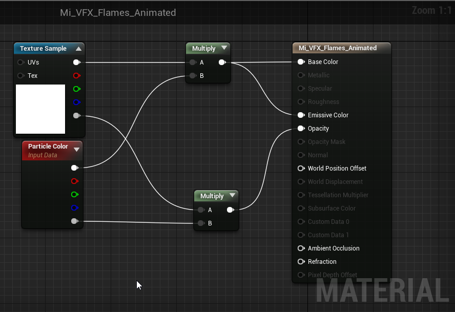
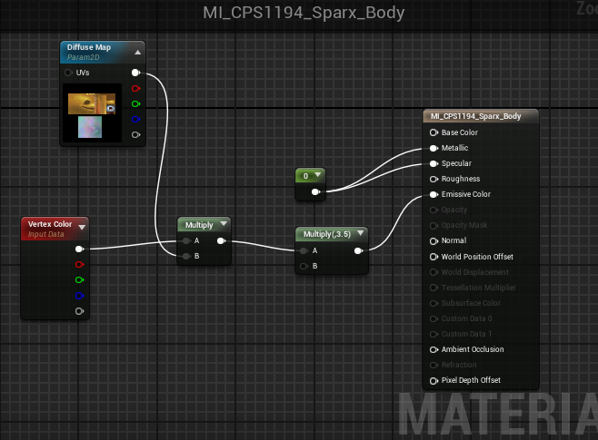

These materials contain parameters that are controlled by the game internally. You may choose to use them in order for the material to work properly, or ignore them. All usages shown are basic just to show how they are related to the material's purpose.

Not all are discovered as this is a growing list. If you happen to find parameters to a material and would like to share, please let us know!

# Spyro's Eyes

## Materials

* Falcon/Plugins/Characters/Player/CPS1999_Spyro/Content/Materials
    * `MI_CPS1999_Spyro_Eye_L`
    * `MI_CPS1999_Spyro_Eye_R`

## Parameters

* `l_eye_u_mat` and `r_eye_u_mat`  
Moves the eye texture horizontally
* `l_eye_v_mat` and `r_eye_v_mat`  
Moves the eye texture vertically
* `l_eye_dilate_mat` and `r_eye_dilate_mat`  
Scales the eye texture (possibly unused)

## Usage

***
# Spyro's Cheat Colors

## Material

* Falcon/Plugins/Characters/Player/CPS1999_Spyro/Content/Materials
    * `MI_CPS1999_Spyro_Greyscale`

## Parameters
There are several Parameters used in the material, but only one is edited at runtime.

* `Tint Color`  
Determines the tint of the cheat color. This is changed by the engine.

## Usage

***
# Spyro's Flame
Spyro's flame breath has a few different scattered materials referenced in a particle system. Some of the materials are shared between multiple particle systems (such as for the power up breaths) so changing them will change them in multiple places. The only way to prevent this is to modify the particle system itself.

## Materials

* Falcon/Plugins/VFX_Spryo/Content/Shared/Materials/Fire
    * `MI_VFX_fireSprite_03`
* Falcon/Plugins/VFX_Spryo/Content/Shared/Particles/Characters/Spyro/FlameThrower
    * `MI_VFX_Spyro_Flame_Trail_Solid`
    * `MI_VFX_Spyro_FlameStreak`
    * `MI_VFX_Spyro_Flames_Animated`

## Input Data

* `Particle Color`
Particle color is read from the particle system. This can be ignored and overwritten, however some data (such as randomized or changing colors) will be lost and has to be recreated in the materials.

## Usage

# Sparx's Color Change
## Material And Texture Location
* Material:
    * Falcon/Plugins/Characters/Player/CPS1194_SparxNew/Content/Materials/MI_CPS1194_Sparx_Body
* Textures:
    * Falcon/Plugins/Characters/Player/CPS1194_SparxNew/Content/Textures/T_CPS1194_SparxNew_C
    * Falcon/Plugins/Characters/Player/CPS1194_SparxNew/Content/Textures/T_CPS1194_SparxNew_C_Blue
    * Falcon/Plugins/Characters/Player/CPS1194_SparxNew/Content/Textures/T_CPS1194_SparxNew_C_Green

## Parameters
Create **TextureSampleParameter2D** and name it `Diffuse Map`, this will be the main texture that controls Sparx's color, use full health texture as default.

## Usage

